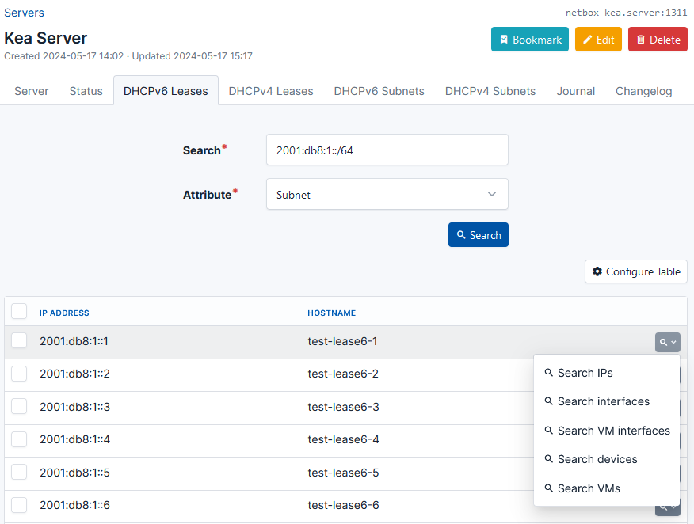

# NetBox plugin for the Kea DHCP server

This plugin allows you to view Kea status, leases and subnets in NetBox. Go directly from a NetBox device/VM to a DHCP lease and back!

## Features

- Uses the Kea management API
- View Kea daemon statuses. 
- Supports Kea's DHCPv4 and DHCPv6 servers.
- View, delete, export and search for DHCP leases.
- Search for NetBox devices/VMs directly from DHCP leases.
- View DHCP subnets from Kea's configuration.
- REST API and GraphQL support for managing Server objects.



## Limitations

- Due to limitations in the Kea management API, pagination is only supported when searching for leases by subnet.
  Additionally, you can only go forwards, not backwards.

- Searching for leases by subnet ID does not support pagination. This may be an expensive operation depending on the subnet size.

- Kea doesn't provide a way to get a list of subnets without an additional hook library.
  Thus, this plugin lists subnets using the `config-get` command. This means that the entire config will be fetched just to get the configured subnets!
  This may be an expensive operation.

## Requirements

- NetBox > v3.5.
- [Kea Control Agent](https://kea.readthedocs.io/en/latest/arm/agent.html)
- [`lease_cmds`](https://kea.readthedocs.io/en/latest/arm/hooks.html#lease-cmds-lease-commands-for-easier-lease-management) hook library

## Compatibility

- This plugin was tested with Kea v2.2.0 with the `memfile` lease database.
  Other versions and lease databases may also work.

## Installation

1. Add `netbox-kea` to `local_requirements.txt`.

2. Enable the plugin in `configuration.py`
    ```python
    PLUGINS = ["netbox_kea"]
    ```
3. Run `./migrate.py migrate`

## Custom Links

You can add custom links to NetBox models to easily search for leases.

Make sure to replace `<Kea Server ID>` in the link URL with the object ID of your Kea server. To find a server's ID, open the page for the server
and look at the top right corner for `netbox_kea.server:<Server ID Here>`.

### Show DHCP leases for a prefix

**Content types**: `IPAM > Prefix`

**Link URL**: `https://netbox.example.com/plugins/kea/servers/<Kea Server ID>/leases{{ object.prefix.version }}/?q={{ object.prefix }}&by=subnet`

### Show DHCP leases for a device/VM interface (by MAC):

**Content types**: `DCIM > Interface`, `Virtualization > Interface`

**Link URL (DHCPv4)**: `https://netbox.example.com/plugins/kea/servers/<Kea Server ID>/leases4/?q={{ object.mac_address }}&by=hw`

**Link URL (DHCPv6)**: `https://netbox.example.com/plugins/kea/servers/<Kea Server ID>/leases6/?q={{ object.mac_address }}&by=hw`

### Show DHCP leases for a device/VM (by name):

**Content types**: `DCIM > Device`, `Virtualization > Virtual Machine`

**Link URL (DHCPv4)**: `https://netbox.example.com/plugins/kea/servers/<Kea Server ID>/leases4/?q={{ object.name|lower }}&by=hostname`

**Link URL (DHCPv4)**: `https://netbox.example.com/plugins/kea/servers/<Kea Server ID>/leases6/?q={{ object.name|lower }}&by=hostname`

You may also use a custom field by replacing `{{ object.name|lower }}` with `{{ object.cf.<your custom field>|lower }}`.
